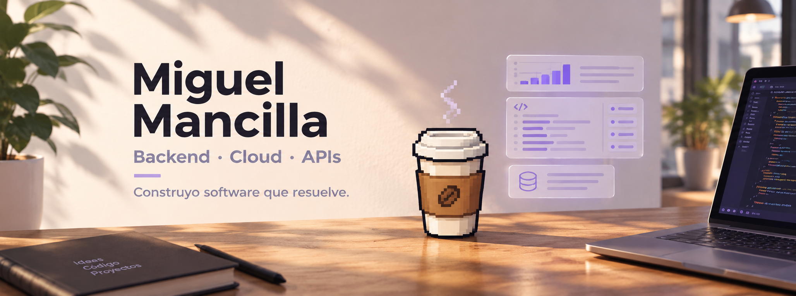

<div align="center">



<br><br>

# Hola, soy Miguel 👋

<p>
  Backend Developer en formación · Cloud · APIs · Ciberseguridad
</p>

<p>
  Construyo APIs, servicios backend y soluciones orientadas a la nube.
  Me interesa crear software seguro, mantenible y que resuelva problemas reales.
</p>

<a href="https://github.com/miguelmancillam">
  
</a>

<br><br>


</div>

---

## `$ whoami`

<table>
  <tr>
    <td width="33.33%" valign="top">

### 👨‍💻 Perfil

Estudiante de Ingeniería en Informática y desarrollador enfocado en backend.

Experiencia en monitoreo operacional, gestión de incidentes y construcción de soluciones internas.

    </td>
    <td width="33.33%" valign="top">

### 🎯 En qué trabajo

- APIs REST y autenticación
- Microservicios y arquitectura
- Bases de datos relacionales
- Docker y despliegues cloud
- Dashboards, KPIs y automatización

    </td>
    <td width="33.33%" valign="top">

### 🌱 Aprendiendo

- Azure y AWS
- Linux, DevOps y Kubernetes
- Ciberseguridad aplicada
- IA, RAG y agentes
- Inglés técnico

    </td>
  </tr>
</table>

<br>

```text
miguelmancillam@github:~$ profile --summary

role:     Backend Developer
location: Santiago, Chile 🇨🇱
focus:    APIs · Cloud · DevOps · Cybersecurity
mindset:  Learn → Build → Test → Improve
```

---

## `$ cat tech-stack.yaml`

<h2><code>$ cat tech-stack.yaml</code></h2>

<table>
  <tr>
    <td width="33%" valign="top" align="center">

<h3>⚙️ Backend & APIs</h3>


<br><br>

<code>Node.js</code> · <code>TypeScript</code><br>
<code>NestJS</code> · <code>Python</code> · <code>Django</code><br>
<code>REST APIs</code> · <code>JWT</code> · <code>Auth</code>

    </td>

    <td width="33%" valign="top" align="center">

<h3>🗄️ Data & Persistence</h3>


<br><br>

<code>PostgreSQL</code> · <code>Prisma</code><br>
<code>MySQL</code> · <code>MongoDB</code><br>
<code>Migrations</code> · <code>Data modeling</code>

    </td>

    <td width="33%" valign="top" align="center">

<h3>☁️ Cloud & DevOps</h3>


<br><br>

<code>Azure</code> · <code>AWS</code> · <code>Docker</code><br>
<code>Linux</code> · <code>GitHub Actions</code><br>
<code>Cloudflare</code> · <code>CI/CD</code>

    </td>
  </tr>
</table>

<br>

<div align="center">

<h3>🧰 Herramientas de trabajo</h3>


<br><br>

<code>Git</code> · <code>GitHub</code> · <code>Postman</code> · <code>VS Code</code> · <code>Bash</code>

</div>
---

## `$ systemctl status learning`

<table>
  <tr>
    <td width="33.33%" valign="top">

### 🟢 Backend

```text
status: active
focus: APIs, auth,
microservices
```

    </td>
    <td width="33.33%" valign="top">

### 🟡 Cloud & DevOps

```text
status: in-progress
focus: Azure, AWS,
Docker and CI/CD
```

    </td>
    <td width="33.33%" valign="top">

### 🟣 Security & AI

```text
status: learning
focus: security,
RAG and automation
```

    </td>
  </tr>
</table>

---

## `$ ls ~/featured-projects`

<table>
  <tr>
    <td width="50%" valign="top">

### 🔐 APIs y microservicios

Servicios backend desarrollados con Node.js, NestJS, TypeScript, Prisma y PostgreSQL.

- JWT, refresh tokens y sesiones
- Validación y manejo de errores
- Arquitectura modular
- APIs REST y pruebas con Postman
- Persistencia y migraciones

    </td>
    <td width="50%" valign="top">

### 🎫 Gestión de tickets

Soluciones para registrar, organizar y hacer seguimiento de tickets, incidentes y actividades operacionales.

Enfocado en mejorar la trazabilidad, centralizar información y apoyar el monitoreo de procesos.

    </td>
  </tr>
  <tr>
    <td width="50%" valign="top">

### 📊 Dashboards y KPIs

Dashboards con Django, APIs REST y JavaScript para visualizar indicadores y facilitar la toma de decisiones.

    </td>
    <td width="50%" valign="top">

### 🚀 Despliegues cloud

Prácticas de despliegue y publicación con Azure, AWS, Docker, Cloudflare Pages y fundamentos de CI/CD.

    </td>
  </tr>
</table>

---

## `$ connect --socials`

<div align="center">

<a href="https://www.linkedin.com/in/mancillamiguel">
  
</a>
&nbsp;
<a href="mailto:contacto.m.empleos@gmail.com">
  
</a>
&nbsp;
<a href="https://github.com/miguelmancillam">
  
</a>

<br><br>

<sub>
  Hecho con código, curiosidad y muchas horas de práctica desde Santiago, Chile 🇨🇱
</sub>

</div>
